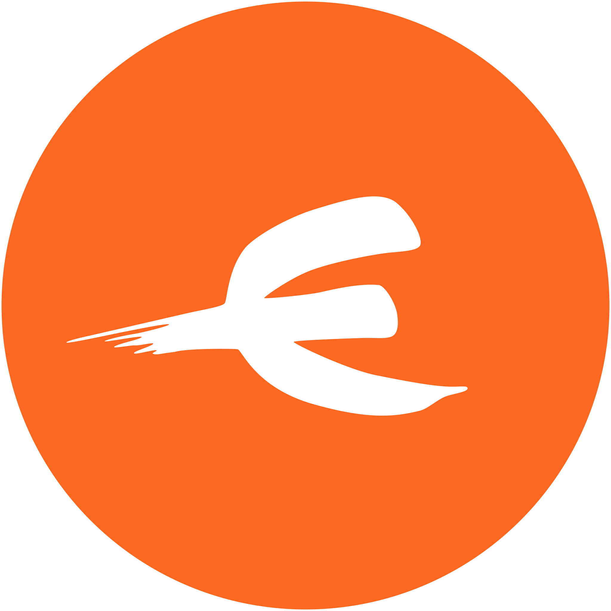

<h1 align="center"> 👋 Hey there </h1>

I focus on developing websites and web applications written in React. I'm proficient in coding graphical designs into HTML/CSS with JavaScript elements.  
As a **Junior Frontend Developer & Coder**, I lack extensive experience in the field, but I compensate for this with passion and a desire to learn through self-study and the development of personal projects.  
Currently, I am educating myself in web application development using React and aiming to write dynamic website content.  
I am seeking an opportunity to join a team where I can professionally grow and apply my skills in real-world projects.  

 

## 🙋‍♀️  About me

🏢 I’m currently working as **Web Content Editor**  
👨‍💻 I become a **Junior Frontend Developer & Coder**  
🧠 I’m currently learning **React 1 - Basics**   
🎯 My next goal to learn **TypeScript**  
🔍 My projects on **[Frontend Mentor](https://www.frontendmentor.io/profile/wendykr)** challenges  
⚡ If I'm not coding, you're typing **English words** into the keyboard 

 

## 🛠️ Skills and Tools

          

     

 

## :heavy_check_mark: Completed Project

- **[Words Game](https://github.com/wendykr/WORDS-GAME)** - a dynamic multi-page website programmed with React and built with Vite
- **[Personal portfolio](https://github.com/wendykr/RESUME-CV)** - a single page website coded with HTML, Tailwind & JavaScript  
- **[Vinarstvi](https://github.com/wendykr/ZAVERECNY-PROJEKT-Winery)** - a static multi-page website programmed with JavaScript and built with Webpack  
- **[EXPO Event burza Pardubice](https://github.com/wendykr/ZAVERECNY-PROJEKT-Expo)** - a static multi-page website coded with HTML/CSS and generated with Eleventy  

 

## 📱 Let's Connect

    

<!--
**wendykr/wendykr** is a ✨ _special_ ✨ repository because its `README.md` (this file) appears on your GitHub profile.

Here are some ideas to get you started:

- 🔭 I’m currently working on ...
- 🌱 I’m currently learning 
- 👯 I’m looking to collaborate on ...
- 🤔 I’m looking for help with ...
- 💬 Ask me about ...
- 📫 How to reach me: ...
- 😄 Pronouns: ...
- ⚡ Fun fact: ...

🧠 I’m currently learning **JavaScript 2**  
🎓 I’m currently educating on **ReactGirls Mentoring** as **Mentee**   
🔭 I’m currently finishing programming **[Vinarstvi](https://github.com/wendykr/ZAVERECNY-PROJEKT-Winery)** website via JavaScript  
-->
