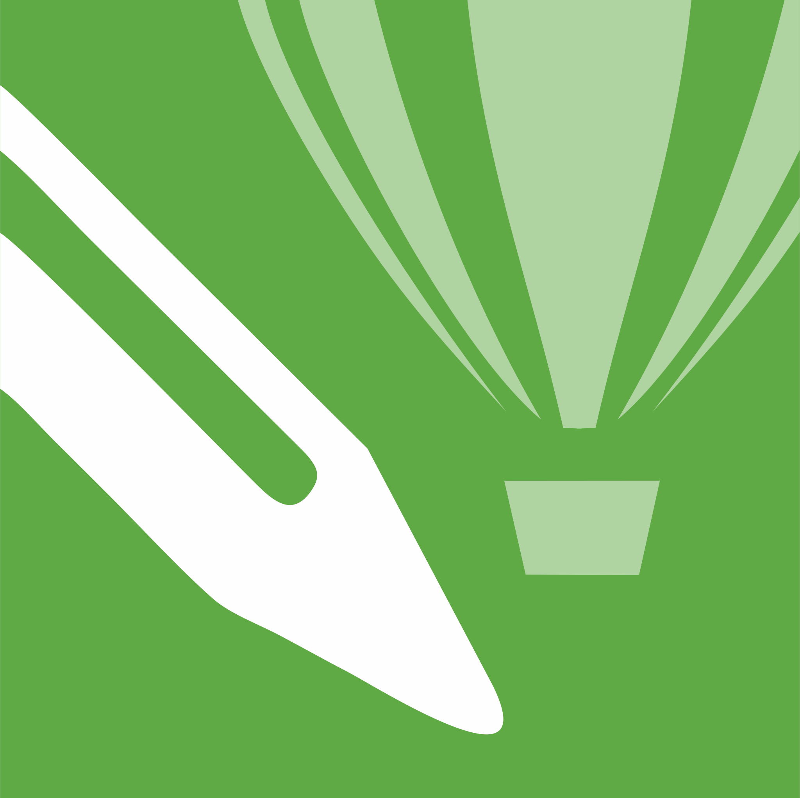

<h1 align="center"> 👋 Hey there </h1>

I want to transition from writing and creating web content to coding. That's why I'm educating myself to become a **Junior Frontend Coder**.  
I enjoy transforming graphic designs into modern and functional websites, and I'm looking for employment in a team where I can continue improving in that field.  

💭 *"I like frontend, because I can customise the website to my needs, not me succumbing to them."*

 

## 🙋‍♀️  About me

🏢 I’m currently working as **Web Content Editor**  
👨‍💻 I become a **Junior Frontend Coder**  
🔭 I’m currently working on **[Winery Theme](https://github.com/wendykr/ZAVERECNY-PROJEKT-Winery)** website programmed via JavaScript   
🎯 My next goal to learn **React**  
🔍 My projects on **[Frontend Mentor](https://www.frontendmentor.io/profile/wendykr)** challenges  

 

## 🛠️ Skills and Tools

       

     

 

## ⏳ Latest Project

- **[EXPO Event burza Pardubice](https://github.com/wendykr/ZAVERECNY-PROJEKT-Expo)** - a static multi-page website coded with HTML/CSS and generated with Eleventy  

 

## ✍ Contact me

📧 [Send an e-mail](mailto:vendysacek@seznam.cz)

<!--
**wendykr/wendykr** is a ✨ _special_ ✨ repository because its `README.md` (this file) appears on your GitHub profile.

Here are some ideas to get you started:

- 🔭 I’m currently working on ...
- 🌱 I’m currently learning 
- 👯 I’m looking to collaborate on ...
- 🤔 I’m looking for help with ...
- 💬 Ask me about ...
- 📫 How to reach me: ...
- 😄 Pronouns: ...
- ⚡ Fun fact: ...

🧠 I’m currently learning **JavaScript 2**  
-->
