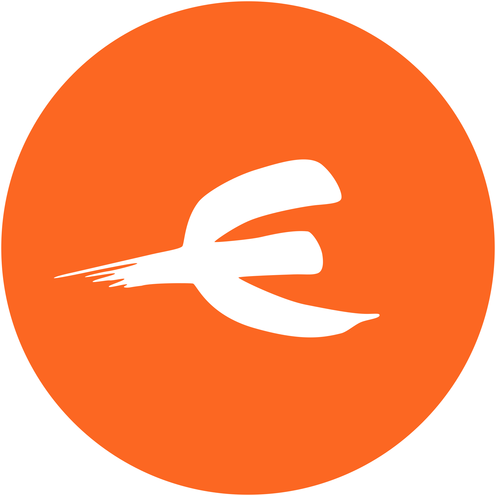

<h1 align="center"> 👋 Hey there </h1>

I develop websites and web applications in React with TypeScript and have practical experience with pure JavaScript. I code website designs from Figma into responsive HTML/CSS and enhance them with interactive elements.  
Next.js is a natural extension of my work with React, and I am gradually using it in the development of new projects.  
I’m not actively looking at the moment, but I welcome new connections and short-term collaborations.  

 

## 🙋‍♀️  About me

🏢 I’m currently working as **Frontend Developer**    
🧠 I’m currently learning **Next.js**  
🎯 My next goal to learn **Vue**  
🔍 My projects on **[Frontend Mentor](https://www.frontendmentor.io/profile/wendykr)** challenges  
⚡ If I'm not coding, I'm typing **English words** into the keyboard 

 

## 🛠️ Skills and Tools

  
  
  
  
  
  
  
  
  

  
  
  
  

 

## :heavy_check_mark: Completed Project

- **[XXXMuck](https://github.com/wendykr/xxxmuck-nextjs)** - a dynamic multi-page website programmed with Next.js & TypeScript, fetched data from API and build with Vite  
- **[Superkviz](https://github.com/wendykr/superkviz-app-ts)** - a dynamic multi-page website programmed with React & TypeScript, fetched data from Supabase and build with Vite  
- **[Personal website and portfolio](https://github.com/wendykr/MY-SITE)** - a dynamic single page website programmed with React & TypeScript and build with Vite  
- **[Words Game](https://github.com/wendykr/WORDS-GAME)** - a dynamic multi-page website programmed with React, fetched data from Supabase and built with Vite  
- **[Filmova databaze](https://github.com/wendykr/the-movie-db-app)** - a dynamic multi-page website programmed with React, fetched data from API and built with Vite  
- **[Vinarstvi](https://github.com/wendykr/ZAVERECNY-PROJEKT-Winery)** - a static multi-page website programmed with JavaScript and built with Webpack  
- **[EXPO Event burza Pardubice](https://github.com/wendykr/ZAVERECNY-PROJEKT-Expo)** - a static multi-page website coded with HTML/CSS and generated with Eleventy  

 

## 📱 Let's Connect

    

<!--
**wendykr/wendykr** is a ✨ _special_ ✨ repository because its `README.md` (this file) appears on your GitHub profile.

Here are some ideas to get you started:

- 🔭 I’m currently working on ...
- 🌱 I’m currently learning 
- 👯 I’m looking to collaborate on ...
- 🤔 I’m looking for help with ...
- 💬 Ask me about ...
- 📫 How to reach me: ...
- 😄 Pronouns: ...
- ⚡ Fun fact: ...

🏢 I’m currently working as **Web Content Editor**  
👨‍💻 I become a **Frontend Developer**  
🧠 I’m currently learning **JavaScript 2**  
🧠 I’m currently learning **React 2 - Tools and Techniques with TypeScript**   
🎓 I’m currently educating on **ReactGirls Mentoring** as **Mentee**   
🔭 I’m currently programming **[Tweetovani](https://github.com/wendykr/tweetovani-app)** app using React and TypeScript 
🔭 I’m currently finishing programming **[Vinarstvi](https://github.com/wendykr/ZAVERECNY-PROJEKT-Winery)** website via JavaScript  
-->
